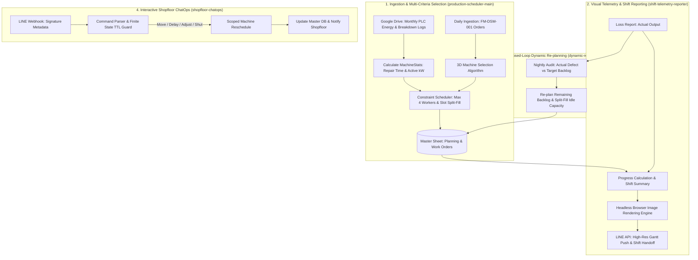

# Production Scheduling & Factory Line Orchestration

[](https://n8n.io/)
[](https://developer.mozilla.org/)
[](https://developers.line.biz/)

Four n8n workflows connect production orders, machine scoring, labor-constrained scheduling, LINE shopfloor commands, and shift reporting.

---

## 📌 Architectural Overview

The system operates across 4 synchronized pipelines forming a real-time autonomous feedback loop:



---

## ⚙️ Core Technical Highlights

### 1. Multi-Criteria Decision Analysis (3D Machine Optimization Engine)
Instead of static machine assignment, orders are evaluated across a 3-dimensional ratio-to-best matrix:
* **Defect Rate (40%):** Evaluated from real production history ($100 - \text{Good}\%$).
* **Mean Time to Repair (MTTR) (40%):** Computed dynamically from historical breakdown logs ($\Sigma \text{Hours} / \Sigma \text{Occurrences}$).
* **Active Energy Demand (20%):** Derived from PLC telemetry logs where operating demand $> 5\text{ kW}$.

$$\text{Composite Score} = 0.40 \cdot S_{\text{Defect}} + 0.40 \cdot S_{\text{Repair}} + 0.20 \cdot S_{\text{Energy}}$$

* **Banding & Load Balancing:** Machines scoring within $15\%$ of the top score ($\ge \text{Top} \times 0.85$) are grouped into a candidate band, routing the job to the machine with the lowest active workload to eliminate bottlenecks.

---

### 2. Multi-Constraint Dynamic Event-Driven Scheduling
* **Factory Workforce Constraint:** The factory operates with a strict capacity limit of **at most 4 workers active concurrently across all machines** ($\text{Total Workers} \le 4$). Single-product jobs require 1 worker; heterogeneous multi-product jobs require 2 workers.
* **Non-Blocking Queue Simulation:** When a job completes on machine $M_i$, worker capacity is immediately released back to the global pool, triggering the next eligible job in the queue.
* **Split-Fill Optimization:** If idle capacity ($\ge 24\text{ hours}$) is detected alongside a long-running batch ($\ge 24\text{ hours}$), the engine splits the order and loads it across parallel idle machines, driving labor utilization toward 100%.

---

### 3. State-Machine ChatOps and Signature Inspection
* **Signature inspection:** The parser computes an HMAC-SHA256 comparison when a channel secret and raw body are available, then attaches `sigValid` to the event. The exported flow does not reject commands based on this flag; enforce signature validation before exposing the webhook for operational use.
* **State TTL Protection:** State changes (delay delivery, quantity adjustments, job transfers, machine emergency shutdown) utilize a memory-backed pending state with a **5-minute expiration timer (TTL)** requiring explicit user confirmation.
* **Dynamic Scoped Re-plan:** In the event of machine failure (`ย้ายเครื่อง / เครื่องเสีย`), the engine recalculates only the affected machine's downstream jobs, automatically redirecting them to available machines while keeping unaffected lines running undisturbed.

---

### 4. Automated Visual Telemetry Pipeline
* Evaluates real-time production output vs. target deadlines across the entire production week.
* Dynamically constructs custom HTML/CSS responsive Gantt charts with defect indicators, schedule slippage overlays, and shift handoff logs.
* Dispatches HTML to an internal headless rendering service, uploads artifacts to cloud storage, and pushes high-resolution images and shift briefings directly to operational staff at 16:00 daily.

---

## 📂 Workflow Directory

| Workflow File | Role | Triggers | Key Responsibilities |
| :--- | :--- | :--- | :--- |
| `production-scheduler-main.json` | Master Scheduler | Midnight Schedule / Monthly Cron / Manual | Multi-criteria machine selection, labor-constrained scheduling, and initial work order dispatch. |
| `dynamic-replan-engine.json` | Closed-Loop Dynamic Re-plan | Daily 06:00 Schedule / Manual | Nightly backlog audit against actual output, dynamic remaining-quantity replanning, and split-fill optimization. |
| `shopfloor-chatops.json` | Real-time Shopfloor ChatOps | LINE Webhook (POST) | Signature inspection, 5-min TTL state machine, and scoped machine failover/rescheduling. |
| `shift-telemetry-reporter.json` | Telemetry & Visual Shift Reports | Daily 16:00 Schedule / Manual | Headless HTML-to-image Gantt rendering, cloud artifact storage, and shift briefings pushed via LINE. |

---

## 🚀 Setup & Deployment

### Prerequisites
1. **n8n Instance** (with node versions compatible with the exported workflows)
2. **Google Workspace Service Account / OAuth2** (Drive & Sheets scope)
3. **LINE Messaging API Developer Channel**

### Import Workflows
1. Clone this repository:
   ```bash
   git clone https://github.com/Panutle/autonomous-factory-mes.git
   cd autonomous-factory-mes
   ```
2. In your n8n interface, select **Workflows** > **Import from File**.
3. Import the 4 JSON files from the `workflows/` directory.
4. Link your Google Sheets and LINE API credentials within each respective node.


## Reproduction notes

This repository contains workflow exports. The source spreadsheets, operational datasets, credentials, and connected services must be supplied separately.

1. Import the JSON files with the workflows inactive and resolve any unavailable node types.
2. Rebind credential references to accounts in your own n8n instance.
3. Replace document IDs, sheet names, folder IDs, webhook endpoints, LINE recipient IDs, and embedded configuration in both Code and HTTP Request nodes. Credential binding alone is not enough.
4. Match sheet headers and data types to the field names read by the workflow; there is no automatic source-schema provisioning.
5. Run a representative input against test destinations and inspect the extracted records or generated plan. Verify the workflow timezone and alert recipients before enabling schedules.

The shift reporter also needs Dropbox credentials and the external HTML-to-image rendering service referenced by its HTTP Request nodes. That service is not included here.

The exports demonstrate implementation choices; this repository does not include a reproducible benchmark for accuracy, time savings, or production availability.
